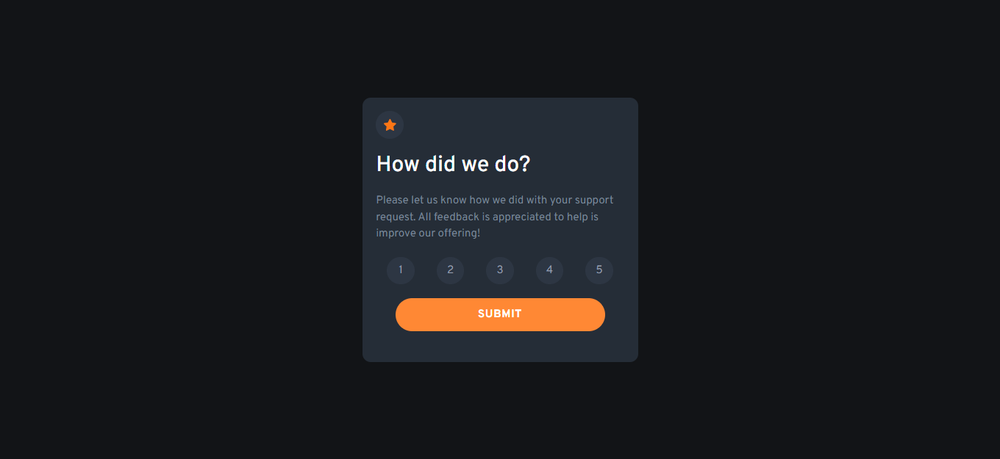
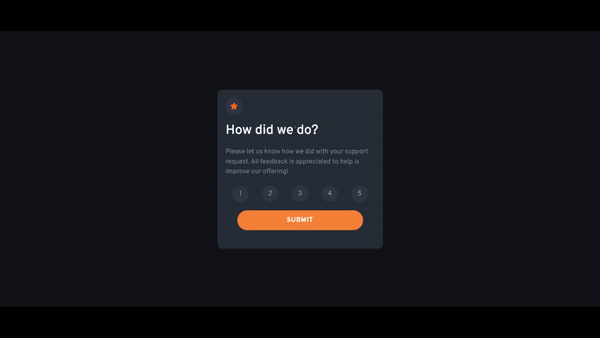

<h1 align='center'>Interative Component</h1>
</br>
<p align='center'>O componente faz uma interação com o usuário para uma avaliação de 1 a 5.
Para o projeto foi usado React com react-router-dom para dinamização da página.
Para estilização foi usado TailwindCss .</p>



<br/>

<h2 >Demonstração 📺</h2>

</br>

<h2>Stack utilizada 🛠</h2>
<p><b>Front-end:</b> React, TailwindCSS</p>

</br>

## Instalação ⚙

Instale my-project com npm

```bash
  git clone https://github.com/jonas-nb/ComponenteInterativo
  npm install my-project
  cd my-project
```

<br/>

## Deploy ☁

Para fazer o deploy desse projeto rode

```bash
  npm vite build
```


<br/>

## Referência 📚

-   [Design preview for the Interactive rating component coding challenge](./design/desktop-preview.jpg)
-   [Frontend Mentor](https://www.frontendmentor.io) challenges help you improve your coding skills by building realistic projects.

<br/>

## Autores 🖊

-   [@jonas-nb](https://www.github.com/jonas-nb)
